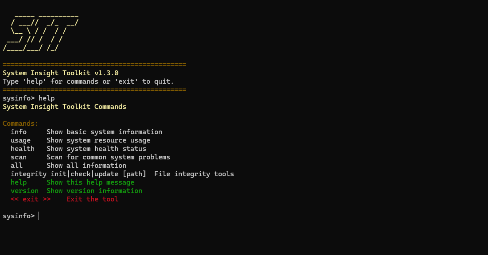

# SIT — System Insight Toolkit

**SIT** is a lightweight, cross-platform **system monitoring toolkit** written in C++17.
It provides real-time system metrics, health scoring, problem scanning, and file integrity checking — with output in **Terminal**, **JSON**, or **CSV** format for easy integration with ML pipelines and monitoring dashboards.

---

## Features



### System Information
- Operating system name, CPU model, total RAM, disk capacity, uptime, current user

### Real-Time Usage
- CPU, RAM, and disk usage percentages with raw byte values

### Health Scoring
- Per-component health labels (Good / Moderate / Critical)
- Overall composite health score (0–100)

### Problem Scanner
- Detects high CPU/RAM usage, long uptimes, and overheating
- Configurable thresholds via `config.h`

### File Integrity Checker
- SHA-256 manifest-based change detection
- Flags changed, missing, or new files

### Output Formats
- **Terminal** — ANSI-colored human-readable output (default)
- **JSON** — structured output for APIs and automation
- **CSV** — flat rows for ML ingestion and time-series analysis
- **Schema** — machine-readable field metadata (types, units, ranges)

### Continuous Monitoring
- `--watch` mode with configurable polling interval
- Outputs NDJSON or CSV streams for real-time data collection

---

## Project Structure

```
SIT/
├── CMakeLists.txt              # Build system
├── README.md
├── LICENSE
├── src/
│   ├── main.cpp                # Entry point
│   ├── core/                   # Data model & business logic
│   │   ├── config.h            #   Constants & thresholds
│   │   ├── systemInfo.h        #   SystemSnapshot struct & accessors
│   │   ├── systemInfo.cpp
│   │   ├── health.h            #   Health scoring
│   │   └── health.cpp
│   ├── platform/               # OS abstraction layer
│   │   ├── platform.h          #   Cross-platform interface
│   │   └── platform.cpp        #   Windows/Linux implementations
│   ├── cli/                    # Command-line interface
│   │   ├── cli.h
│   │   └── cli.cpp
│   ├── formatter/              # Output formatting
│   │   ├── formatter.h         #   Terminal, JSON, CSV, Schema
│   │   └── formatter.cpp
│   └── integrity/              # File integrity checker
│       ├── integrity.h
│       └── integrity.cpp
├── assets/
└── .github/workflows/          # CI (Linux + Windows)
```

---

## Build Instructions

### Requirements
- **C++17** compatible compiler
- **CMake 3.16+** (recommended)
- Windows: MSVC, MinGW, or Clang  ·  Linux: GCC or Clang

### Build with CMake (Recommended)

```bash
# Configure
cmake -B build -DCMAKE_BUILD_TYPE=Release

# Build
cmake --build build --config Release

# Run
./build/sysinfo --help
```

### Build with g++ (Manual)

```bash
# Linux
g++ -std=c++17 -O2 -Wall -Wextra -Isrc \
    src/main.cpp src/cli/cli.cpp src/core/systemInfo.cpp \
    src/core/health.cpp src/platform/platform.cpp \
    src/formatter/formatter.cpp src/integrity/integrity.cpp \
    -o sysinfo

# Windows (MinGW)
g++ -std=c++17 -O2 -Wall -Wextra -Isrc ^
    src/main.cpp src/cli/cli.cpp src/core/systemInfo.cpp ^
    src/core/health.cpp src/platform/platform.cpp ^
    src/formatter/formatter.cpp src/integrity/integrity.cpp ^
    -o sysinfo.exe -ladvapi32
```

---

## Usage

### Command-Line Mode

```bash
./sysinfo [command] [options]
```

#### Commands
| Command     | Description |
|-------------|-------------|
| `info`      | Show basic system information |
| `usage`     | Show system resource usage |
| `health`    | Show system health status |
| `scan`      | Scan for common system problems |
| `all`       | Show all information |
| `schema`    | Print field metadata as JSON |
| `integrity` | `init\|check\|update [path]` — file integrity tools |
| `help`      | Show help message |
| `version`   | Show version information |

#### Options
| Option                        | Description |
|-------------------------------|-------------|
| `--format=json\|csv\|terminal` | Output format (default: terminal) |
| `--watch`                     | Continuous monitoring mode |
| `--interval=N`                | Polling interval in ms (default: 1000) |

#### Examples

```bash
# Basic commands
./sysinfo info
./sysinfo usage
./sysinfo health

# JSON output (for APIs / automation)
./sysinfo all --format=json

# CSV output (for ML / data science)
./sysinfo all --format=csv

# Continuous monitoring — NDJSON stream
./sysinfo usage --format=json --watch --interval=2000

# Continuous monitoring — CSV to file
./sysinfo usage --format=csv --watch --interval=1000 > metrics.csv

# Field metadata for ML pipelines
./sysinfo schema

# File integrity
./sysinfo integrity init
./sysinfo integrity check
./sysinfo integrity update
```

### Interactive Mode

Run without arguments to enter the interactive shell:

```bash
./sysinfo
```

```
   _____ __________
  / ___//  _/_  __/
  \__ \ / /  / /
 ___/ // /  / /
/____/___/ /_/

System Insight Toolkit v1.3.0
Type 'help' for commands or 'exit' to quit.
==============================================
sysinfo> usage
sysinfo> health
sysinfo> exit
```

---

## Supported Platforms

| Platform | API Used | Status |
|----------|----------|--------|
| **Windows** | WinAPI, Registry | ✅ Fully supported |
| **Linux** | `/proc`, `/sys`, `std::filesystem` | ✅ Fully supported |

CI runs on both `ubuntu-latest` and `windows-latest` via GitHub Actions.

---

## Architecture

```
┌─────────┐     ┌──────────────┐     ┌──────────────┐
│  main   │────▶│     CLI      │────▶│  Formatter   │──▶ Terminal / JSON / CSV
└─────────┘     │  (cli/)      │     │ (formatter/) │
                └──────┬───────┘     └──────────────┘
                       │
                ┌──────▼───────┐     ┌──────────────┐
                │  SystemInfo  │────▶│   Platform   │──▶ WinAPI / /proc
                │  (core/)     │     │ (platform/)  │
                └──────┬───────┘     └──────────────┘
                       │
                ┌──────▼───────┐
                │   Health     │
                │  (core/)     │
                └──────────────┘
```

All OS-specific code is isolated in `platform/`. The rest of the codebase is pure C++17 with no platform conditionals.

---

## Design Philosophy

- **Zero external dependencies** — standard library and native OS APIs only
- **Layered architecture** — platform → core → formatter → CLI
- **ML-ready output** — structured JSON, CSV, and schema metadata
- **Cross-platform** — single codebase, conditional compilation isolated in one module
- **Lightweight** — no background services or invasive system access

---

## License

MIT License — see [LICENSE](LICENSE) for details.

---

### Author
---
**Rayan (Fally)**  
Cybersecurity Student • Systems Engineer • Builder of unnecessarily powerful tools